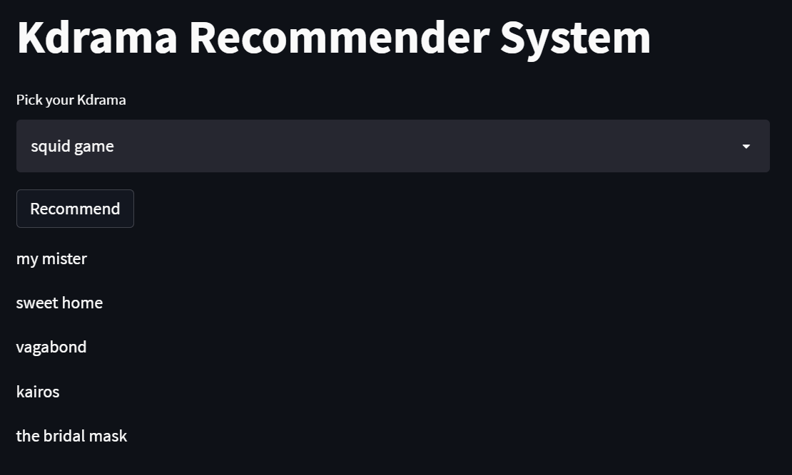

# Kdrama_recommendation_system
## Deployed Website Link:
https://manaswini2001tech-kdrama-recommendation-system-app-tgngck.streamlit.app/
## To run locally:
streamlit run "app.py"
## Dataset
https://www.kaggle.com/code/chanoncharuchinda/sample-top-100-korean-dramas/data?scriptVersionId=91941497

# KDrama Recommender System Viability:
Korean TV drama, or K-drama, has been popular throughout Asia since the 1990s, but only reached Europe and the Americas within the last decade. Since then, K-drama has captured the hearts of millions of western viewers, making it a truly global trend.
Recommender systems estimate the most likely product that consumers will buy and that they will be interested in. Netflix, Amazon, and other companies use recommender systems to help their users find the right product or movie for them. Since Kdrama is a rising trend globally, our Recommender system will recommend you Kdramas based on the content of your chosen drama as base for recommendations.

* Content Based Recommender System

## Deployed Images

